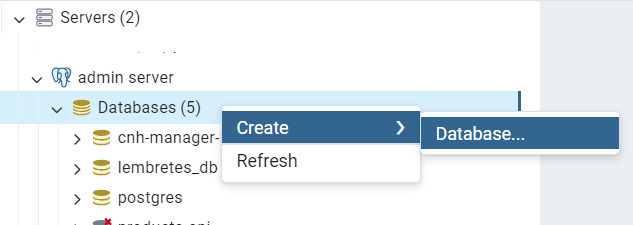

# Sistema de Lembretes

[](https://www.djangoproject.com/)
[](https://vuejs.org/)

## Descrição
Este projeto é uma APIRestFul de um Sistema de Lembretes construído em Django Rest Framework no lado do servidor (backend) e Vue.js no lado do cliente (frontend). 
O sistema permite adição, exclusão e listaegem dos lembretes em ordem cronológica.

## Tecnologias Necessárias
É necessário que o ambiente local possua algumas tecnologias já instaladas.
1. [Python v. 3+](https://www.python.org/downloads/)
2. [PostgreSQL](https://www.postgresql.org/download/)
3. [Node.js](https://nodejs.org/en/download)

## Interface

## Instalação

Para executar o projeto localmente, siga as seguintes etapas:

### Backend
A primeira coisa a se fazer é configurar o projeto no lado servidor.

1. Clone esse repositório:
   ```bash
   https://github.com/imcathalat/sistema-de-lembretes-teste-pratico-dti.git
   ```
   
2. Na pasta clonada raiz, crie e ative o ambiente virtual:
   
No Windows:
 ```bash
 python -m venv venv
 venv/Scripts/activate
 ```
No macOs Linux:
```bash
python -m venv venv
source venv/bin/activate
```

3. Instale as dependências:
   ```bash
   pip install -r requirements.txt
   ```
   
4. Crie um banco de dados no PostgreSQL através do pgAdmin4 ou do psql:
   

  
5. Renomeie o arquivo .env.example para .env
  ```bash
  .env.example para .env
  ```

6. Modifique as variáveis de ambiente no arquivo .env:
  ```bash
  DB_NAME= nome_do_banco
  DB_USER= nome_do_usuario_que_criou_o_banco (por padrão postgres)
  DB_PASSWORD= senha_do_servidor_que_o_banco_esta
  ```
7. Entre na pasta backend:
   ```bash
   cd backend
   ```
8. Migre o banco de dados:
```bash
python manage.py migrate
```

9. Rode o servidor:
```bash
python manage.py runserver
```

## Frontend
Com o servidor backend funcionando, é hora de colocar o frontend para funcionar. 

Esse processo deve ser feito em outro terminal, uma vez que para a aplicação funcionar o servidor backend deve estar em funcionamento durante toda a execução.
A interação com o sistema será feita através do servidor frontend (link recebido no final).

1. Ative o ambiente virtual na pasta raiz:

No Windows:
  ```bash
  python -m venv venv
  venv/Scripts/activate
 ```
No macOs Linux:
  ```bash
  python -m venv venv
  source venv/bin/activate
  ```

2. Entre na pasta frontend:
   ```bash
   cd frontend
   ```

3. Instale as dependências:
   ```bash
   npm install
   ```
   
4. Rode o servidor frontend:
   ```bash
   npm run dev
   ```
   
5. Digite a url fornecida pelo servidor no seu navegador:
   ```bash
   http://localhost:5173/
   ```

## Testes
Foram realizados testes unitários e de integração. Para executa-los, é necessário abrir o projeto em outro terminal.


1. Ative o ambiente virtual que esta na pasta raiz:
   
No Windows:
   ```bash
   python -m venv venv
   venv/Scripts/activate
   ```
No macOs Linux:
```bash
python -m venv venv
source venv/bin/activate
```

2. Entre na pasta backend:
   ```bash
   cd backend
   ```

3. Execute o comando para rodar os testes:
   ```bash
   python manage.py test main
   ```

## Versionamento do código
O código foi versionado utilizando git através do terminal. A fim de manter a integridade do projeto, foram criadas duas branches para gerencia-lo:
- Features: As atualizações foram desenvolvidas e testadas aqui.
- Main: As funcionalidades já testadas ficavam aqui.
