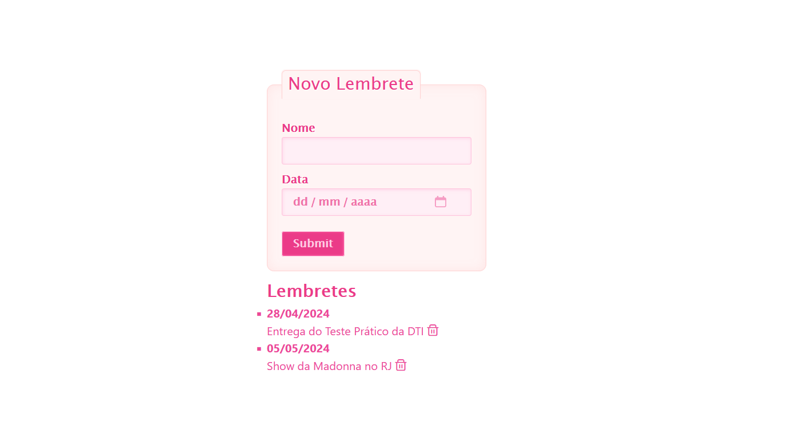

# Sistema de Lembretes

[](https://www.djangoproject.com/)
[](https://vuejs.org/)
[](https://www.postgresql.org/)

## Descrição
Este projeto é uma APIRestFul de um Sistema de Lembretes construído em Django Rest Framework no lado do servidor (backend) e Vue.js no lado do cliente (frontend). 
O sistema permite adição, exclusão e listagem dos lembretes em ordem cronológica.

### Escolha das Tecnologias
As tecnologias escolhidas para realizar o teste se basearam no meu atual conhecimento das ferramentas disponíveis no mercado para criação de API's RESTFul. 
Considerei mais prudente trabalhar com algo que já tenho conhecimento prévio, uma vez que o meu tempo de dedicação ao teste não pôde ser integral.
No entanto, gostaria de esclarecer que estou aberta ao aprendizado do C# e do React, e creio que entender o processo de construção de uma APIRestFul facilita o meu aprendizado de quaisquer ferramentas que tenham isso como propósito.

**Observações:**
- O componente vue.js utilizado para renderizar o frontend do teste se chama 'Lembretes.vue' e se encontra no caminho 'src/components/Lembretes.vue' da pasta frontend.

[requisitos do teste prático](images/pdf-teste-pratico-dti.pdf)

## Tecnologias Necessárias
É necessário que o ambiente local possua algumas tecnologias já instaladas.
1. [Python v. 3+](https://www.python.org/downloads/)
2. [PostgreSQL](https://www.postgresql.org/download/)
3. [Node.js](https://nodejs.org/en/download)

## Interface


## Versionamento do código
O código foi versionado utilizando git através do terminal. A fim de manter a integridade do projeto, foram criadas duas branches para gerencia-lo:
- Features: As atualizações foram desenvolvidas e testadas aqui.
- Main: As funcionalidades já testadas ficavam aqui.

## Instalação

Para executar o projeto localmente, siga as seguintes etapas:

### Backend
A primeira coisa a se fazer é configurar o projeto no lado servidor.

1. Clone esse repositório:
   ```bash
   https://github.com/imcathalat/sistema-de-lembretes-teste-pratico-dti.git
   ```
   
2. Na pasta clonada raiz, crie e ative o ambiente virtual (É importante que seja na pasta que possui o diretório venv):
   
No Windows:
 ```bash
 python -m venv venv
 venv/Scripts/activate
 ```
No macOs Linux:
```bash
python -m venv venv
source venv/bin/activate
```

3. Instale as dependências:
   ```bash
   pip install -r requirements.txt
   ```
   
4. Crie um banco de dados no PostgreSQL através do pgAdmin4 ou do psql:
   

  
5. Renomeie o arquivo .env.example para .env
  ```bash
  .env.example para .env
  ```

6. Modifique as variáveis de ambiente no arquivo .env:
  ```bash
  DB_NAME= nome_do_banco
  DB_USER= nome_do_usuario_que_criou_o_banco (por padrão postgres)
  DB_PASSWORD= senha_do_servidor_que_o_banco_esta
  ```
7. Entre na pasta backend:
   ```bash
   cd backend
   ```
8. Migre o banco de dados (É importante que todos os comandos que inciam com python manage.py sejam realizados no diretório backend):
```bash
python manage.py migrate
```

9. Rode o servidor:
```bash
python manage.py runserver
```

10. Verifique se o servidor esta aberto na porta 8000 (É imprescíndivel para o funcionamento da API):
    ```bash
    http://127.0.0.1:8000/
    ```

## Frontend
Com o servidor backend funcionando, é hora de colocar o frontend para funcionar. 

Esse processo deve ser feito em outro terminal, uma vez que para a aplicação funcionar o servidor backend deve estar em funcionamento durante toda a execução em consonância com o servidor frontend.
A interação com o sistema será feita através do servidor frontend (link recebido no final).

1. Ative o ambiente virtual na pasta raiz (Na pasta que possui o diretório venv):

No Windows:
  ```bash
  python -m venv venv
  venv/Scripts/activate
 ```
No macOs Linux:
  ```bash
  python -m venv venv
  source venv/bin/activate
  ```

2. Entre na pasta frontend:
   ```bash
   cd frontend
   ```

3. Instale as dependências (É importante que esse e o próximo comando sejam executados dentro da pasta frontend):
   ```bash
   npm install
   ```
   
4. Rode o servidor frontend:
   ```bash
   npm run dev
   ```
   
5. Digite a url fornecida pelo servidor no seu navegador (É importante que a porta seja 5173):
   ```bash
   http://localhost:5173/
   ```

## Testes
Foram realizados testes unitários e de integração. Para executa-los, é necessário abrir o projeto em outro terminal.


1. Ative o ambiente virtual que esta na pasta raiz:
   
No Windows:
   ```bash
   python -m venv venv
   venv/Scripts/activate
   ```
No macOs Linux:
```bash
python -m venv venv
source venv/bin/activate
```

2. Entre na pasta backend:
   ```bash
   cd backend
   ```

3. Execute o comando para rodar os testes (É importante que o comando seja executado dentro da pasta backend):
   ```bash
   python manage.py test main
   ```

## Agradecimentos
Gostaria de Agradecer a equipe DTI por terem me notado no dia do TechTalent. Foi uma supresa muito agradável receber uma mensagem da Pâmela Alonso me comunicando sobre a possibilidade da participação na segunda etapa do processo seletivo da empresa. Foi um prazer realizar o teste e o aprendizado que ganhei colocando em prática os conhecimentos necessários para entrega-lo já fizeram todos os minutos valerem a pena. 🦋

